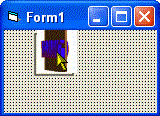



## GIF ANIMATION CONTROL :: fully resizable

### Description

This is a control that displays animated gif images.

The control, and its associated animated gif are totally resizable.

Its properties include pathToGif which is the string path to the animated gif, ShowBorder, offsetx and offsety allow you to center or frame the animation perfectly for your tastes. feedback comments and upgrade ideas totally welcomed
 
### More Info
 

             |
---                |---
**Submitted On**   |2005-02-18 15:50:56
**By**             |[Evan Toder](https://github.com/Planet-Source-Code/PSCIndex/blob/master/ByAuthor/evan-toder.md)
**Level**          |Intermediate
**User Rating**    |4.9 (39 globes from 8 users)
**Compatibility**  |VB 3\.0, VB 4\.0 \(16\-bit\), VB 4\.0 \(32\-bit\), VB 5\.0, VB 6\.0
**Category**       |[Custom Controls/ Forms/  Menus](https://github.com/Planet-Source-Code/PSCIndex/blob/master/ByCategory/custom-controls-forms-menus__1-4.md)
**World**          |[Visual Basic](https://github.com/Planet-Source-Code/PSCIndex/blob/master/ByWorld/visual-basic.md)
**Archive File**   |[GIF\_ANIMAT1854532182005\.zip](https://github.com/Planet-Source-Code/evan-toder-gif-animation-control-fully-resizable__1-58990/archive/master.zip)

